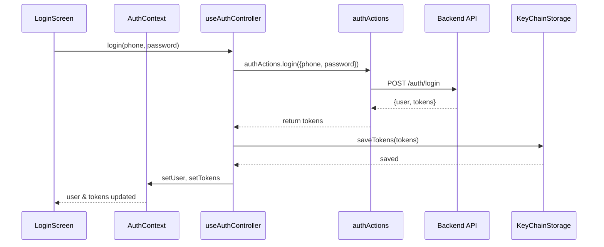
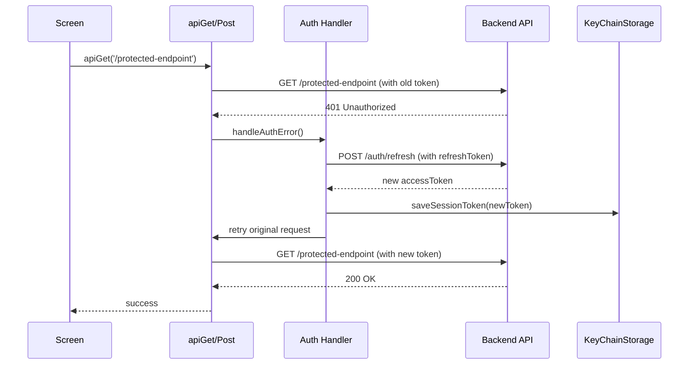

# Authentication Flow

## Overview

Standard authentication flow for both Worker and Customer apps.

## Flow Diagram



## Step-by-Step

### 1. User Enters Credentials

**Screen**: `src/screens/auth/LoginScreen.tsx`

```typescript
export function LoginScreen() {
  const { login, isLoading } = useAuthContext();
  const [phone, setPhone] = useState('');
  const [password, setPassword] = useState('');

  const handleLogin = async () => {
    try {
      await login(phone, password);
      // Navigation handled by context effect
    } catch (error) {
      // Error toast already shown by context
    }
  };

  return (
    <View>
      <TextInput
        placeholder="Phone number"
        value={phone}
        onChangeText={setPhone}
      />
      <TextInput
        placeholder="Password"
        value={password}
        onChangeText={setPassword}
        secureTextEntry
      />
      <Button onPress={handleLogin} disabled={isLoading}>
        {isLoading ? 'Logging in...' : 'Login'}
      </Button>
    </View>
  );
}
```

### 2. Controller Calls Action

**Controller**: `src/hooks/useAuthController.ts`

```typescript
export function useAuthController() {
  const [user, setUser] = useState<User | null>(null);
  const [tokens, setTokens] = useState<AuthTokens | null>(null);
  const [isLoading, setIsLoading] = useState(false);

  const login = async (phone: string, password: string) => {
    try {
      setIsLoading(true);
      
      // Call action
      const response = await authActions.login({ phone, password });
      
      // Save tokens
      await saveSessionToken(response.tokens.accessToken);
      await saveRefreshToken(response.tokens.refreshToken);
      
      // Update state
      setUser(response.user);
      setTokens(response.tokens);
      
      showApiSuccessToast('Login successful');
    } catch (error) {
      showApiErrorToast(error);
      throw error;
    } finally {
      setIsLoading(false);
    }
  };

  return { user, tokens, isLoading, login };
}
```

### 3. Action Makes HTTP Request

**Action**: `src/actions/authActions.ts`

```typescript
export const authActions = {
  login: async (params: LoginRequest): Promise<LoginResponse> => {
    const response = await apiPost<LoginResponse>(
      '/auth/login',
      params
    );
    return response;
  },
};
```

### 4. Storage Saves Tokens

**Storage**: `src/utils/key-chain-storage/session-token.ts`

```typescript
import * as SecureStore from 'expo-secure-store';

const SESSION_TOKEN_KEY = 'auth:session-token';

export async function saveSessionToken(token: string): Promise<void> {
  await SecureStore.setItemAsync(SESSION_TOKEN_KEY, token);
}

export async function getSessionToken(): Promise<string | null> {
  return SecureStore.getItemAsync(SESSION_TOKEN_KEY);
}

export async function clearSessionToken(): Promise<void> {
  await SecureStore.deleteItemAsync(SESSION_TOKEN_KEY);
}
```

### 5. Auto Navigation

**Effect in Controller**: `src/hooks/useAuthController.ts`

```typescript
useEffect(() => {
  if (user && tokens) {
    // Navigation happens here
    // (could use useNavigation hook or listener)
    navigateToAppHome();
  }
}, [user, tokens]);
```

## Token Refresh Flow



## Logout Flow

```typescript
// Controller
const logout = async () => {
  try {
    await authActions.logout();
    
    // Clear state
    setUser(null);
    setTokens(null);
    
    // Clear storage
    await clearSessionToken();
    await clearRefreshToken();
    
    // Navigation
    navigateToLogin();
  } catch (error) {
    showApiErrorToast(error);
  }
};
```

## Error Handling

```typescript
try {
  await login(phone, password);
} catch (error) {
  // Error code from backend
  const code = (error as any).code;
  
  if (code === 'INVALID_CREDENTIALS') {
    // Show specific error
  } else if (code === 'USER_NOT_FOUND') {
    // Show signup prompt
  } else {
    // Show generic error
  }
}
```

## Token Storage Rules

### Worker App

- **`phoneToken`**: Used only for phone verification endpoint
  - Storage: `src/utils/key-chain-storage/phone-token.ts`
  - Cleared after profile creation

- **`accessToken`**: Used for all authenticated APIs
  - Storage: `src/utils/key-chain-storage/session-token.ts`
  - Refreshed when expired

- **`refreshToken`**: Used to obtain new access token
  - Storage: `src/utils/key-chain-storage/refresh-token.ts`
  - Never sent as Authorization header

### Customer App

- Same as worker app (parity required)

## Parity Rules

Both apps must implement:

- Same login flow structure
- Same token storage approach
- Same refresh logic
- Same error handling
- Same navigation triggers

See [AGENTS.md](/AGENTS.md#3-http-client-rules) for token rules.
