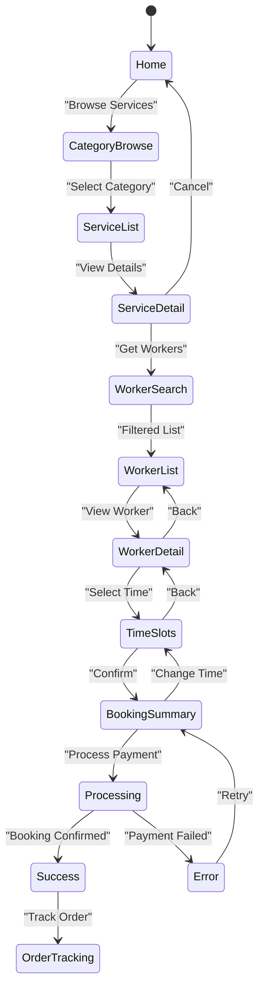

# Booking Flow (Customer App)

## Overview

The booking flow is the core customer experience: browse services → select worker → pick time → confirm booking.

## Flow Diagram



## Step-by-Step

### 1. Browse Services

**Screen**: `src/screens/home/CategoryBrowseScreen.tsx`

User sees categories (cleaning, plumbing, moving, etc.)

```typescript
export function CategoryBrowseScreen() {
  const { categories, loading } = useCategoryScreenController();

  return (
    <FlatList
      data={categories}
      renderItem={({ item }) => (
        <CategoryCard
          category={item}
          onPress={() => navigate('ServiceList', { categoryId: item.id })}
        />
      )}
    />
  );
}
```

### 2. View Services in Category

**Screen**: `src/screens/booking/ServiceListScreen.tsx`

User sees list of services in selected category

```typescript
export function ServiceListScreen({ route }) {
  const { categoryId } = route.params;
  const { services, loading } = useServiceListScreenController(categoryId);

  return (
    <FlatList
      data={services}
      renderItem={({ item }) => (
        <ServiceCard
          service={item}
          onPress={() => navigate('ServiceDetail', { serviceId: item.id })}
        />
      )}
    />
  );
}
```

### 3. View Service Details

**Screen**: `src/screens/booking/ServiceDetailScreen.tsx`

User sees detailed service info, can proceed to select worker

```typescript
export function ServiceDetailScreen({ route }) {
  const { serviceId } = route.params;
  const { bookingFlow } = useBookingFlowContext();
  const { service, loading } = useServiceDetailController(serviceId);

  const handleSelectService = async () => {
    bookingFlow.selectService(service);
    navigate('WorkerSearch', { serviceId });
  };

  return (
    <View>
      <Text>{service.name}</Text>
      <Text>{service.description}</Text>
      <Text>{service.price}</Text>
      <Button onPress={handleSelectService}>
        Select Worker
      </Button>
    </View>
  );
}
```

### 4. Search/Filter Workers

**Screen**: `src/screens/booking/WorkerSearchScreen.tsx`

User can filter by rating, distance, availability, price

```typescript
export function WorkerSearchScreen({ route }) {
  const { serviceId } = route.params;
  const { workers, filters, setFilters, loading } = useWorkerSearchController(serviceId);

  return (
    <View>
      <FilterBar onFilterChange={setFilters} />
      <FlatList
        data={workers}
        renderItem={({ item }) => (
          <WorkerCard
            worker={item}
            onPress={() => navigate('WorkerDetail', { workerId: item.id })}
          />
        )}
      />
    </View>
  );
}
```

### 5. View Worker Details

**Screen**: `src/screens/booking/WorkerDetailScreen.tsx`

User sees worker profile, reviews, availability

```typescript
export function WorkerDetailScreen({ route }) {
  const { workerId } = route.params;
  const { bookingFlow } = useBookingFlowContext();
  const { worker, availability, loading } = useWorkerDetailController(workerId);

  const handleSelectWorker = async () => {
    bookingFlow.selectWorker(worker);
    navigate('TimeSlots');
  };

  return (
    <View>
      <WorkerProfile worker={worker} />
      <ReviewsList reviews={worker.reviews} />
      <Button onPress={handleSelectWorker}>
        Select This Worker
      </Button>
    </View>
  );
}
```

### 6. Select Time Slot

**Screen**: `src/screens/booking/TimeSlotScreen.tsx`

User picks date and time from available slots

```typescript
export function TimeSlotScreen() {
  const { bookingFlow } = useBookingFlowContext();
  const { selectedWorker, selectedSlot, selectSlot } = bookingFlow;
  const { availableSlots, loading } = useTimeSlotController(selectedWorker.id);

  const handleSelectSlot = (slot) => {
    selectSlot(slot);
    navigate('BookingSummary');
  };

  return (
    <View>
      <Calendar onSelectDate={setSelectedDate} />
      <SlotList
        slots={availableSlots.filter(s => s.date === selectedDate)}
        onSelectSlot={handleSelectSlot}
      />
    </View>
  );
}
```

### 7. Review Booking Summary

**Screen**: `src/screens/booking/BookingSummaryScreen.tsx`

User reviews all details before confirming

```typescript
export function BookingSummaryScreen() {
  const { bookingFlow, submitBooking, isLoading } = useBookingFlowContext();
  const { selectedService, selectedWorker, selectedSlot, bookingData } = bookingFlow;

  const totalPrice = calculateTotalPrice(bookingData);

  const handleSubmit = async () => {
    try {
      await submitBooking();
      navigate('BookingConfirmation');
    } catch (error) {
      showApiErrorToast(error);
    }
  };

  return (
    <View>
      <BookingCard
        service={selectedService}
        worker={selectedWorker}
        slot={selectedSlot}
      />
      <Text>Total: {formatCurrency(totalPrice)}</Text>
      <Button
        onPress={handleSubmit}
        disabled={isLoading}
      >
        {isLoading ? 'Confirming...' : 'Confirm Booking'}
      </Button>
    </View>
  );
}
```

### 8. Booking Confirmation

**Screen**: `src/screens/booking/BookingConfirmationScreen.tsx`

Shows confirmation and order tracking link

```typescript
export function BookingConfirmationScreen() {
  const { lastBooking } = useBookingFlowContext();

  return (
    <View>
      <SuccessAnimation />
      <Text>Booking Confirmed!</Text>
      <Text>Reference: {lastBooking.id}</Text>
      <Button
        onPress={() => navigate('OrderTracking', { orderId: lastBooking.id })}
      >
        Track Order
      </Button>
      <Button onPress={() => navigate('Home')}>
        Back to Home
      </Button>
    </View>
  );
}
```

## State Management

### BookingFlowContext + useBookingFlowController

**State**:
```typescript
interface BookingFlowState {
  selectedService: Service | null;
  selectedWorker: Worker | null;
  selectedSlot: TimeSlot | null;
  bookingData: {
    notes?: string;
    specialRequests?: string;
    bookingType: 'INSTANT' | 'SCHEDULED';
  };
  currentStep: BookingStep;
  isLoading: boolean;
  error: string | null;
}
```

**Actions**:
```typescript
selectService(service: Service): void
selectWorker(worker: Worker): void
selectSlot(slot: TimeSlot): void
updateBookingData(field: string, value: any): void
submitBooking(): Promise<void>
goToStep(step: BookingStep): void
reset(): void
```

## Types

```typescript
// src/types/booking.ts
export interface Service {
  id: string;
  name: string;
  description: string;
  categoryId: string;
  basePrice: number;
  estimatedDuration: number;
}

export interface Worker {
  id: string;
  name: string;
  avatar: string;
  rating: number;
  reviewCount: number;
  phone: string;
  totalJobs: number;
}

export interface TimeSlot {
  id: string;
  date: string; // ISO format
  time: string; // HH:MM
  workerId: string;
}

export interface Booking {
  id: string;
  serviceId: string;
  workerId: string;
  customerId: string;
  slotId: string;
  totalPrice: number;
  status: 'PENDING' | 'ACCEPTED' | 'IN_PROGRESS' | 'COMPLETED' | 'CANCELLED';
  createdAt: string;
}

export type BookingStep = 
  | 'SERVICE_SELECTION'
  | 'WORKER_SELECTION'
  | 'TIME_SELECTION'
  | 'SUMMARY'
  | 'CONFIRMATION';
```

## Utility Helpers

All booking calculations and helpers in `src/utils/booking-flow.ts`:

```typescript
export const calculateTotalPrice = (booking: BookingData): number => {
  // Calculate price with tax, discounts, etc.
};

export const getSlotLabel = (slot: TimeSlot): string => {
  // Format slot as "Monday, 2:30 PM"
};

export const isSlotAvailable = (slot: TimeSlot): boolean => {
  // Check if slot is in future
};

export const canProceedToNextStep = (step: BookingStep, data: BookingFlowState): boolean => {
  // Validate step completion
};
```

## Error Handling

```typescript
try {
  await submitBooking();
} catch (error) {
  const code = (error as any).code;
  
  if (code === 'WORKER_UNAVAILABLE') {
    // Slot no longer available
    showApiErrorToast('Worker is no longer available. Please select another time.');
    goToStep('TIME_SELECTION');
  } else if (code === 'PAYMENT_FAILED') {
    // Payment declined
    showApiErrorToast('Payment declined. Please check your card details.');
  } else {
    // Generic error
    showApiErrorToast(extractErrorMessage(error));
  }
}
```

## Purity Rules

### ✅ In Controller Hook
- Fetch available workers
- Calculate prices
- Validate selections
- Call submitBooking action
- Handle payment flow

### ❌ NOT in Screens
- No price calculations
- No availability checks
- No payment logic
- No complex validations

All go to `useBookingFlowController.ts` and `src/utils/booking-flow.ts`

## Related Documentation

- **Architecture**: [Screen Purity](/docs/architecture/screen-purity.md)
- **State Management**: [Context + Hook Pattern](/docs/state-management/index.md)
- **APIs**: [HTTP Client](/docs/apis/index.md)
- **Parity**: [Booking flow must be identical in both apps](/docs/architecture/parity-rules.md)
