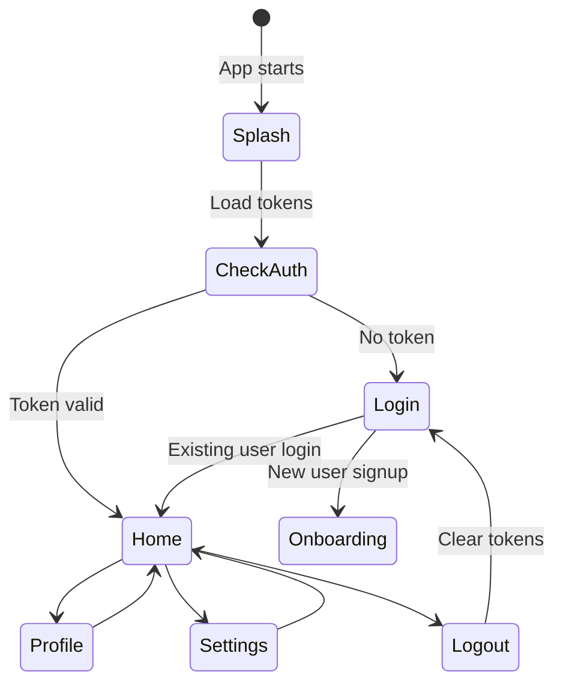
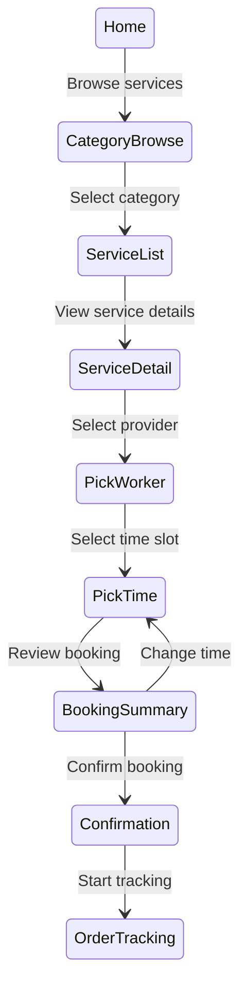

# Flow Documentation

## Dellite Flows

This section documents the main user flows in both apps.

### Worker App Flows

- **[Authentication Flow](auth-flow.md)**: Login, logout, token refresh
- **[Onboarding Flow](../flows/auth-flow.md)**: Phone verification, profile setup
- **Job Acceptance Flow**: Browse jobs, accept, start work
- **Job Completion Flow**: Mark complete, add notes, submit

### Customer App Flows

- **[Authentication Flow](auth-flow.md)**: Login, logout, token refresh
- **[Onboarding Flow](../flows/auth-flow.md)**: Profile setup, address collection
- **[Booking Flow](booking-flow.md)**: Service search, worker selection, time slot selection, booking confirmation
- **Order Tracking Flow**: View active orders, track worker, rate/review

## Mermaid Diagrams

### Auth Flow



### Booking Flow (Customer)



## Flow File Organization

```
docs/flows/
├── index.md                 # This file
├── auth-flow.md             # Auth flow details
├── booking-flow.md          # Customer booking
├── onboarding-flow.md       # User onboarding
└── [flow-name].md           # Add new flows here
```

## Creating a New Flow Document

1. Create `docs/flows/[flow-name].md`
2. Include overview, diagram, step-by-step, error handling
3. Reference relevant screens, actions, contexts
4. Add Mermaid diagrams for visualization
5. Update this index.md with link to new flow

## Related Documentation

- **Architecture**: Context + hook patterns → [/docs/architecture](/docs/architecture/index.md)
- **State Management**: How contexts manage flow state → [/docs/state-management](/docs/state-management/index.md)
- **APIs**: HTTP client and endpoints → [/docs/apis](/docs/apis/index.md)
- **Screens**: UI screens in each flow → [/docs/ui](/docs/ui/index.md)
